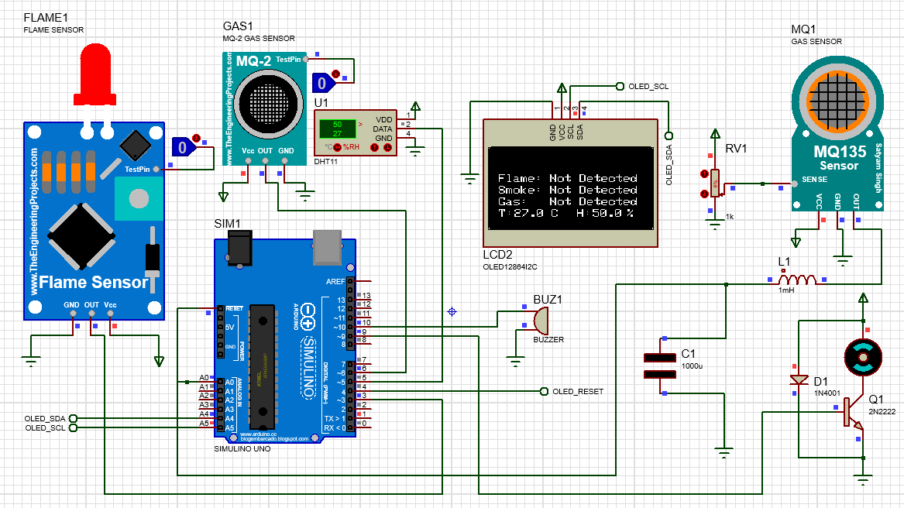

# Smart Kitchen and Alarm System

## Overview
In the consumer electronics space, the Internet of Things (IoT) has increasingly carved a niche market for itself. This project aims to introduce a smart system to monitor, secure, and automate a kitchen environment in real-time. This is done through the use of microcontrollers such as an Arduino Uno R3 and sensors like IR-Flame Sensor, MQ-2 Smoke Sensor, MQ-135 Gas Sensor, DHT11 Temperature and Humidity Sensor. Furthermore, for all-time online connectivity, a NodeMCU Wi-Fi module is used to monitor the sensors via an app designed on the Blynk IoT platform.

## Table of Contents
- [Features](#features)
- [Hardware Components](#hardware-components)
- [Software Components](#software-components)
- [Circuit Diagram](#circuit-diagram)
- [Installation](#installation)
- [Usage](#usage)
- [Contributing](#contributing)
- [License](#license)

## Features
- **Real-time Monitoring**: Continuously monitors the kitchen environment using various sensors.
- **Alert System**: Sounds an alarm when any hazardous conditions are detected.
- **Data Display**: Shows sensor data on an OLED display and a mobile app.
- **Exhaust Control**: Turns on an exhaust fan when humidity levels exceed a certain threshold.

## Hardware Components
- Arduino Uno R3
- IR-Flame Sensor
- MQ-2 Smoke Sensor
- MQ-135 Gas Sensor
- DHT11 Temperature and Humidity Sensor
- NodeMCU Lua V3 ESP8266 Wi-Fi Module
- OLED Display (128x64)
- Passive Buzzer
- 5V Rated Motor (Exhaust Fan)
- Various connectors and jumper wires

## Software Components
- Arduino IDE
- Proteus Pro for simulation
- SketchUp Pro for CAD design
- Blynk IoT platform

## Circuit Diagram

## Installation
### Prerequisites
- Arduino IDE
- Proteus Pro
- SketchUp Pro
- Blynk IoT platform account

### Steps
1. **Download the Repository Files**:
    - Download the files from the repository to your local machine.
2. **Install Arduino IDE**:
    - Download and install the [Arduino IDE](https://www.arduino.cc/en/software).
3. **Install Required Libraries**:
    - Open Arduino IDE and go to `Sketch` -> `Include Library` -> `Manage Libraries`.
    - Install the following libraries:
        - Blynk
        - Adafruit SSD1306
        - Adafruit GFX Library
4. **Upload Arduino Code**:
    - Connect your Arduino Uno R3 to your computer.
    - Open the provided Arduino code file (`smart_kitchen.ino`).
    - Select the correct board and port under `Tools`.
    - Click on the upload button.
5. **Set Up Blynk**:
    - Create a new project in the Blynk app.
    - Add widgets to display sensor data and set up notifications.
    - Note down the Auth Token.
    - Insert the Auth Token in the Arduino code.
6. **Simulation**:
    - Open the provided Proteus simulation file (`smart_kitchen.pdsprj`) in Proteus Pro.
    - Run the simulation to test the circuit.

## Usage
1. **Power Up**: Connect the Arduino Uno R3 to a power source.
2. **Monitor via OLED Display**: Observe sensor readings on the OLED display.
3. **Blynk App**: Open the Blynk app on your mobile device to monitor the kitchen environment remotely.
4. **Alerts**: The passive buzzer will sound an alarm if any hazardous conditions are detected.

## Contributing
Contributions are welcome! Please fork this repository and submit a pull request.

## License
This project is licensed under the MIT License - see the [LICENSE](LICENSE) file for details.
